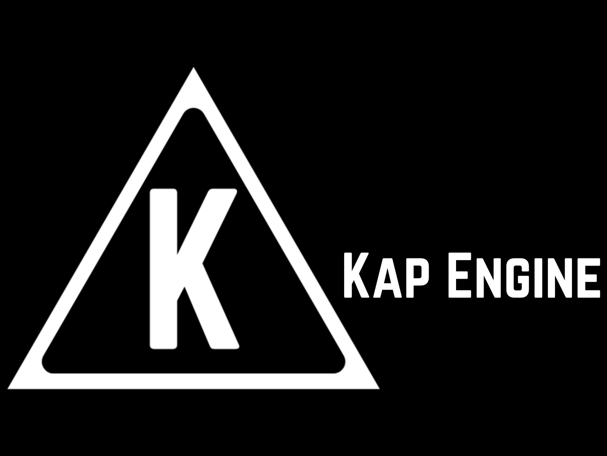

# KapEngine

<figure><figcaption>
Banner of KapEngine
</figcaption></figure>

### What is KapEngine ?

KapEngine is an ECS game engine in C++. Show source code in [github](https://github.com/benji-35/KapEngine).

Made by [benji-35](https://github.com/benji-35) (Benjamin Delvert) and helped by [Chaika9](https://github.com/Chaika9) for compilation and other tips.

This website is made for devlopper that want to create a game with this engine. All you need is write here. If you have a question go to [FAQ](community/faq.md) section.
