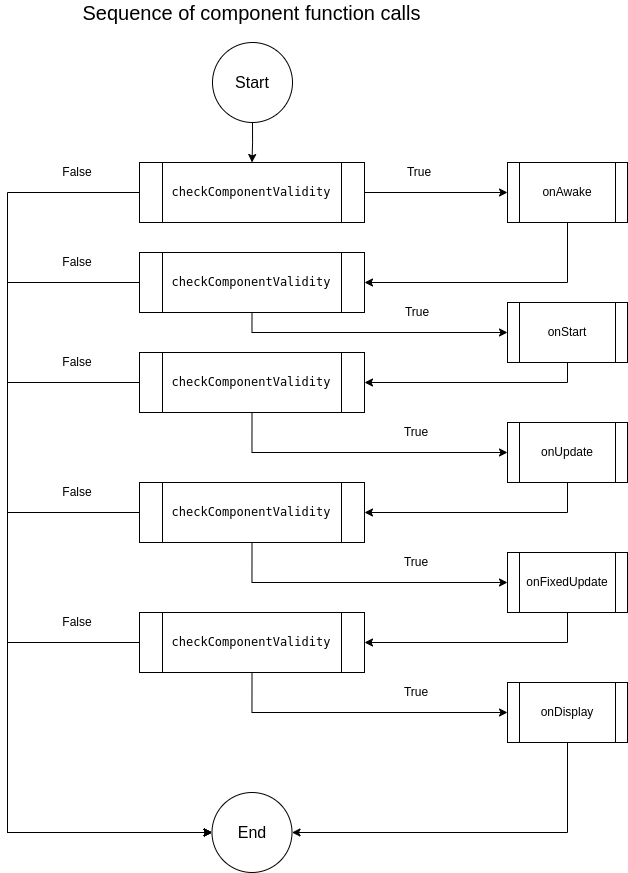

# What is it ?

### Component System

A component is a logical program use to do something in your game.

Each component has some functions made to update, initiate or call for special events during the runtime.

Component is the only thing you gonna code to change or add new gameplay systems

### How component call functions ?&#x20;

<figure><figcaption></figcaption></figure>

### How create my Component ?

To create a new component, follow these instructions :


[create-new-one.md](create-new-one.md)


### List of basic functions


[checkcomponentvalidity.md](checkcomponentvalidity.md)



[onawake.md](onawake.md)



[onstart.md](onstart.md)



[onupdate.md](onupdate.md)



[onfixedupdate.md](onfixedupdate.md)



[ondisplay.md](ondisplay.md)


### List of event functions


[ondestroy-event.md](ondestroy-event.md)



[ongamequit-event.md](ongamequit-event.md)



[ondisable-event.md](ondisable-event.md)



[onenable-event.md](onenable-event.md)



[onmouseenter-event.md](onmouseenter-event.md)



[onmousestay-event.md](onmousestay-event.md)



[onmouseexit-event.md](onmouseexit-event.md)



[ontriggerenter-event.md](ontriggerenter-event.md)



[ontriggerstay-event.md](ontriggerstay-event.md)



[ontriggerexit-event.md](ontriggerexit-event.md)

